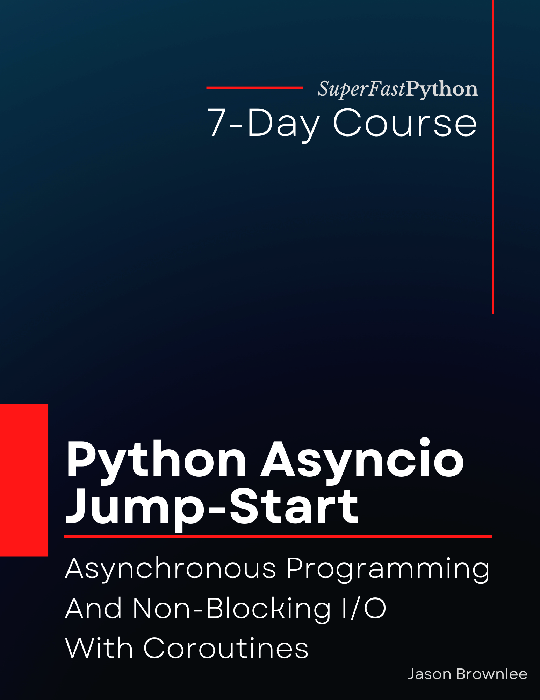

# Python Asyncio Jump-Start

* <https://github.com/SuperFastPython/PythonAsyncioJumpStart>

This repository provides all source code for the book:

* **Python Asyncio Jump-Start**: _Asynchronous Programming And Non-Blocking I/O With Coroutines_, Jason Brownlee, 2022.

## Source Code
You can access all Python .py files directly here:

* [src/](src/)

## Get the Book

You can learn more about the book here:

* [Book Homepage](https://superfastpython.com/python-asyncio-jump-start/)
* [Gumroad](https://superfastpython.gumroad.com/l/paj)
* [Amazon Kindle](https://amzn.to/3DJJJt6)
* [Amazon Paperback](https://amzn.to/3SOxboO)
* [Google Books](http://books.google.com/books/about?id=daSYEAAAQBAJ)
* [Google Play](https://play.google.com/store/books/details?id=daSYEAAAQBAJ)
* [Goodreads](https://www.goodreads.com/book/show/63183137-python-asyncio-jump-start)

### Book Blurb

> Asyncio is an exciting new addition to Python.
>
> It allows regular Python programs to be developed using the asynchronous programming paradigm.
>
> It includes changes to the language to support coroutines as first-class objects, such as the `async def` and `await` expressions, and the lesser discussed `async for` and `async with` expressions for asynchronous iterators and context managers respectively.
>
> Asyncio is the way to rapidly develop scalable Python programs capable of tens or hundreds of thousands of concurrent tasks.
>
> Developing concurrent programs using coroutines and the `asyncio` module API can be very challenging for beginners, especially those new to asynchronous programming.
>
> Introducing: "Python Asyncio Jump-Start". A new book designed to teach you asyncio in Python, super fast!
>
> You will get a rapid-paced, 7-part course focused on getting you started and make you awesome at using asyncio.
>
> Including:
>
> * How to define, schedule, and execute asynchronous tasks as coroutines.
> * How to manage groups of asynchronous tasks, including waiting for al tasks, the first that, or the first task to fail.
> * How to define, create, and use asynchronous iterators, generators, and context manages
> * How to share data between coroutines with quests and how to synchronize coroutines to make code coroutine-safe.
> * How to run commands as subprocesses and how to implement asynchronous socket programming with streams.
> * How to develop a port scanner that is nearly 1,000 times faster than the sequential version.
>
> Each of the 7 lessons was carefully designed to teach one critical aspect of asyncio, with explanations, code snippets, and complete examples.
>
> Each lesson ends with an exercise for you to complete to confirm you understood the topic, a summary of what was learned, and links for further reading if you want to go deeper.
>
> Stop copy-pasting code from StackOverflow answers.
>
> Learn Python concurrency correctly, step-by-step.
